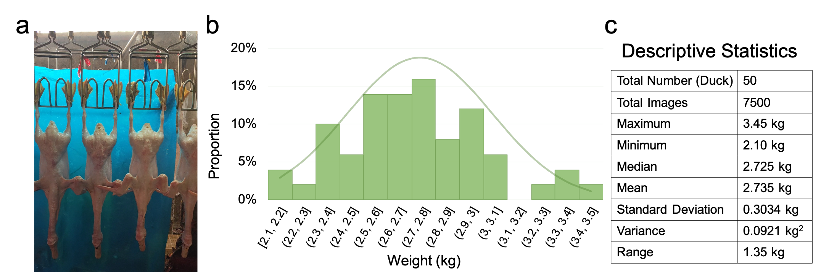
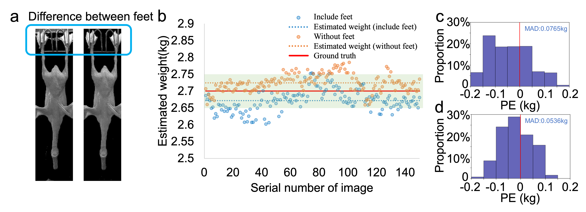
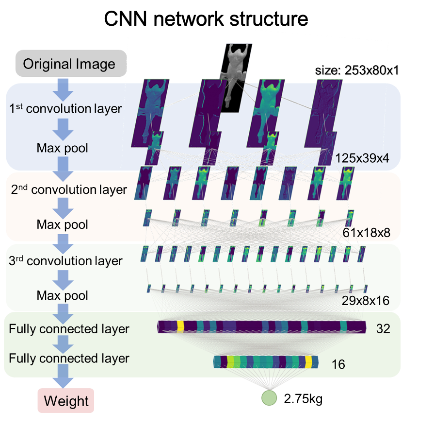
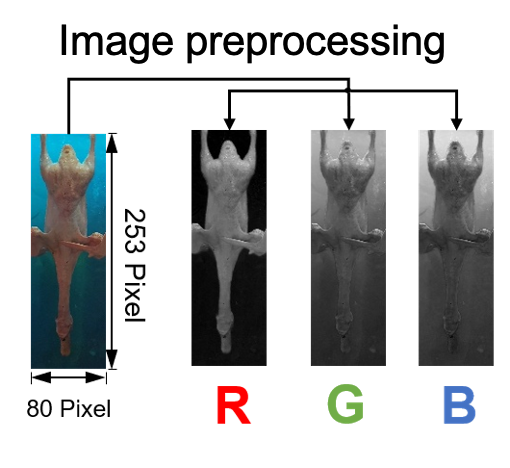

# Image Weighing


This code is the original experimental setup and may be out of date, if you need a clearer implementation please contact me and I can provide a more recent version based on `Pytorch`.

**Official Implementation of our Paper**

Ruoyu Chen, Yuliang Zhao*, Yongliang Yang, Shuyu Wang, Lianjiang Li, Xiaopeng Sha, Lianqing Liu, Guanglie Zhang, and Wen Jung Li. “Online Estimating Weight of White Pekin Duck Carcass by Computer Vision”, *Poultry Science*, 102.2 (2023): 102348.

## 0. Environment

`TensorFlow` version 1.x must relay on `Python<=3.7`

```shell
conda create -n ducknet python=3.7
conda activate ducknet
pip install tensorflow-gpu==1.15.0
pip install opencv-python
```

## 1. Visualization

Our approach is dedicated to achieving real-time image weighing.


## 2. Environment

We consider 2 environments, the first figure shows the work of this project, and the second figure is coming soon.

<table border-left=none border-right=none><tr>
<td width=50%></td>
<td width=50%></td>
</tr></table>

## 3. The Dataset

Please refer to [weight.xls](weight.xls) for labeling data. The images are included in fold [duck2](./duck2).

The statistics of the dataset are as follows:



In the dataset, we remove the feet, because there are some noise, which will reduce the precise of the weight estimation results. A experiment is shown below:



## 4. Reproduce the results 

The main demo is `train_cov_choose_duck_no_background_or_feet.py`, you can try:

```
python train_cov_choose_duck_no_background_or_feet.py
```

to reproduce the results. The structure of the CNN is shown below:



## 5. Preproccessing

The input is a single channel image, where we choose the R channel, as you can see:



R channel is salient for textual information, thus we choose the R channel.

## 6. Method Comparison

We mainly compared two widely used method, pixel regression and ANN prediction.

Please refer to [ablation_study](./ablation_study)


## Acknowledgement

```bibtex
@article{chen2023online,
  title={Online Estimating Weight of White Pekin Duck Carcass by Computer Vision},
  author={Chen, Ruoyu and Zhao, Yuliang and Yang, Yongliang and Wang, Shuyu and Li, Lianjiang and Sha, Xiaopeng and Liu, Lianqing and Zhang, Guanglie and Li, Wen Jung},
  journal={Poultry Science},
  volume={102},
  number={2},
  pages={102348},
  year={2023},
  issn = {0032-5791},
  doi = {https://doi.org/10.1016/j.psj.2022.102348}
}
```
