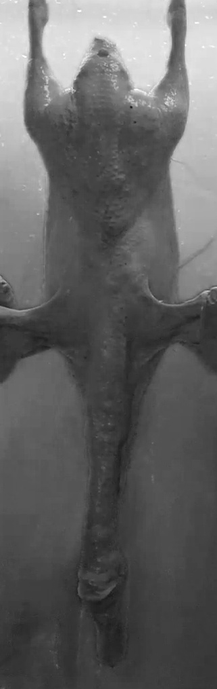
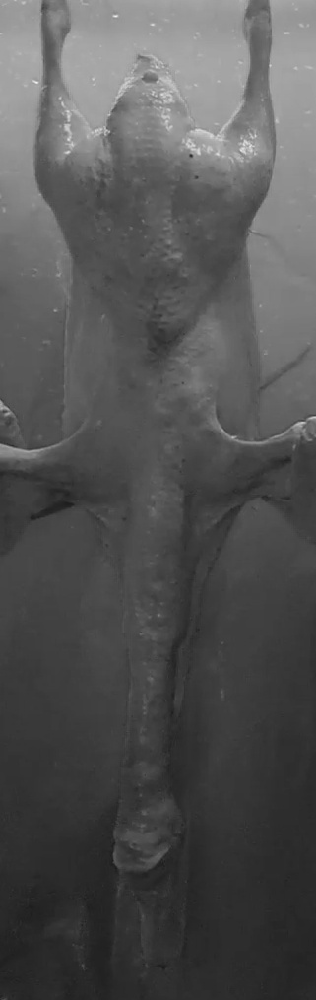
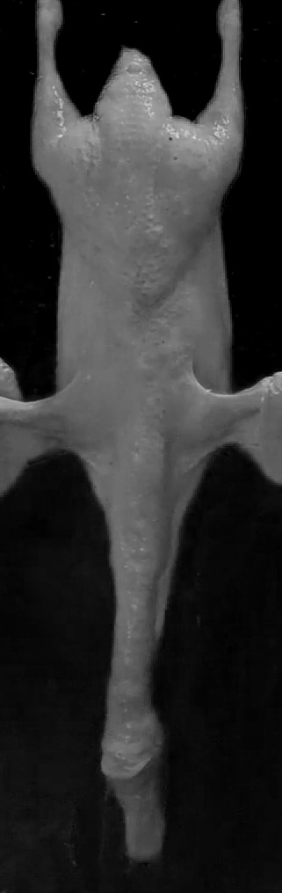

# Image_weighing

## Main 

The main demo is `train_cov_choose_duck_no_background_or_feet.py`, you can try:

```
python train_cov_choose_duck_no_background_or_feet.py
```

to reproduce the results.

## Method

The input is a single channel image, where we choose the R channel, as you can see:

|B|G|R|
|-|-|-|
||||

R channel is salient for textual information, thus we choose the R channel.
