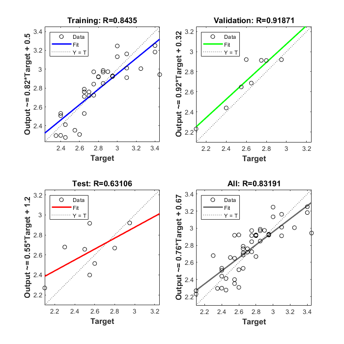
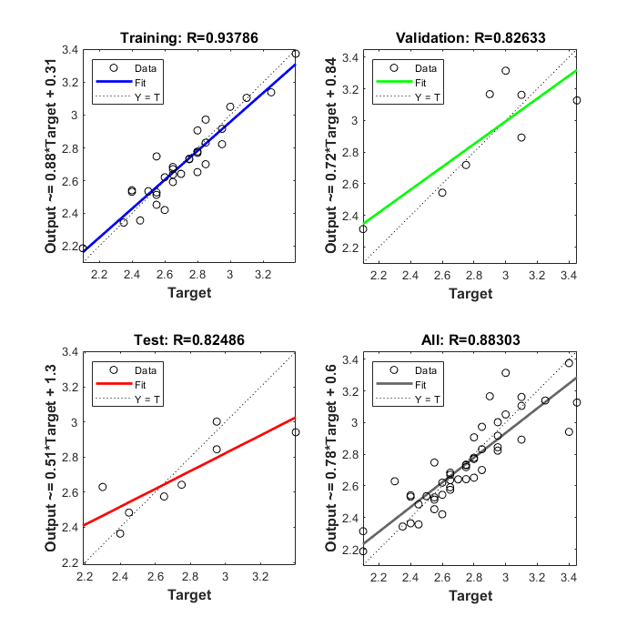
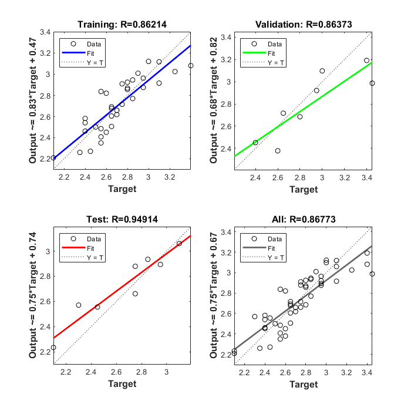
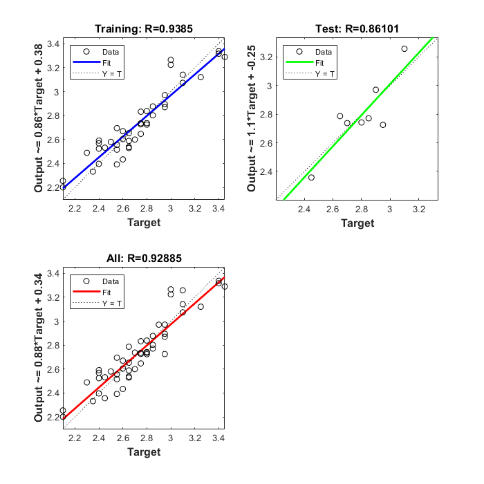

## ANN-based method

The second method compared was an artificial neural network model. The ANN model regressed the weight through features extracted from the duck’s image. Here, we similarly captured the area for the convenience of comparison. The circular kernel of 1 value in size of 39×39 was used by a morphological open operation to segment the back of the duck as a binarized image. Five features, including area, perimeter, convex area, major axis length, and minor axis length, were captured from the segmented image. The ANN model with one hidden layer was trained using the nntool toolbox in MATLAB. Default parameters were adopted for the training: sigmoid as the transfer function for the hidden layer, MSE as the loss function, and learn gradient descent with momentum backpropagation as the adaption learning function.

Table 1 shows the configuration and the estimated weight results of the ducks and the broilers. The model with nine hidden neurons and a Bayesian regulation training algorithm achieved the lowest MAD of 107.0 g and an MRE of 3.79%.

Table 1. Results in different configurations and training algorithms.

| Training algorithm | Number of neurons | Training MAD (gram) | Training RMSE (gram) | Testing MAD (gram) | Testing RMSE (gram) |
| ------------------ | :---------------: | :-----------------: | :------------------: | :----------------: | :-----------------: |
| Gradient descent   |     7             |       129.4         |    161.76            |       183.7        |     217.87          |
| Levenberg–Marquardt|     10            |       70.9          |     89.65            |       149.7        |    209.87           |
|Scaled conjugate gradient|11            |      114.4          |   137.59             |       113.6        |      131.55         |
|Bayesian regulation |      9            |    88.5             |      109.48          |       107.0        |          121.59     |

## Original results

Gradient descent:

Levenberg–Marquardt:

Scaled conjugate gradient:

Bayesian regulation:

